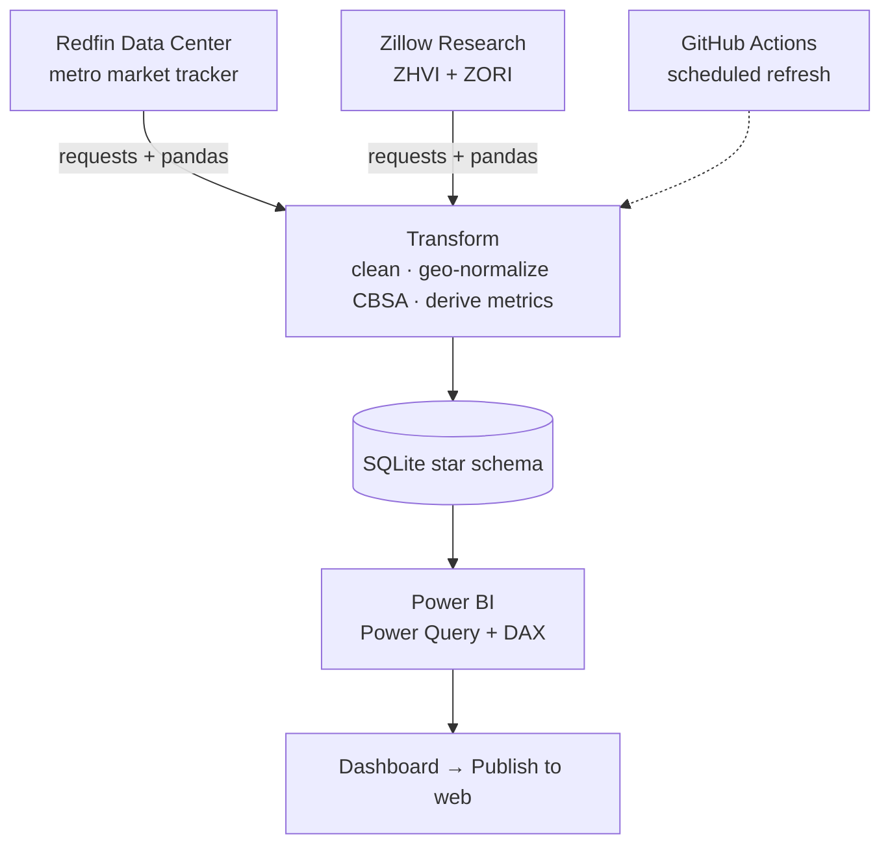

# Parcel

> An end-to-end real-estate **market-analytics** pipeline that turns official public
> housing data into a single view of *where to buy and whether now is the time* — for a
> buy-and-hold investor.

Parcel ingests officially published housing datasets (no scraping), models them into a
SQLite **star schema**, derives investor metrics, and presents them in **Power BI**. It
answers three investor decisions: **market selection** (where to look), **timing** (is a
market heating or cooling), and — as a stretch — **deal context** for individual listings.

**Scope:** focused markets — Charlotte, NC (anchor) plus a configurable set of Sun-Belt
buy-and-hold metros (Raleigh, Atlanta, Nashville, Tampa, Dallas, Columbus, Indianapolis).

## Architecture



**Data model (star schema):** `fact_market` (region × month metrics) → `dim_region`
(CBSA-keyed metros) and `dim_date` (time-intelligence). `fact_listing` is reserved for the
stretch deal screener. See `parcel/db/schema.sql`.

## Data sources (official, published — no scraping)

| Source | Provides | Status in this build |
|---|---|---|
| [Redfin Data Center](https://www.redfin.com/news/data-center/) | sale price, price/sqft, DOM, inventory, months-of-supply, sale-to-list, price-drops | ✅ live |
| [Zillow Research](https://www.zillow.com/research/data/) (ZHVI/ZORI) | home values + **rents** (rent-to-price, GRM, cap rate) | ⏳ pending network allowlist |
| [Realtor.com Econ Research](https://www.realtor.com/research/data/) | listing-side cross-check | optional |
| US Census ACS | income / vacancy enrichment | stretch |

> Both Redfin and Realtor.com key regions on **CBSA code**, so `dim_region.region_id` =
> CBSA — a clean, durable join key.

## Quick start

```bash
make install        # pip install -r requirements.txt
make refresh        # ingest -> transform -> load -> stamp last_updated
```

This builds `db/parcel.sqlite`. A small prebuilt sample lives at
`data/sample/parcel_sample.sqlite` so the Power BI report can be assembled without
re-downloading sources.

## Power BI

The pipeline produces the SQLite database; the report is assembled from
[`powerbi/MEASURES.md`](powerbi/MEASURES.md), which specs every DAX measure, the table
relationships, and a view-by-view layout. MVP views: **Market Ranking**, **Market Detail**,
and a **KPI header**.

## Status

- ✅ Repo scaffold, config, ingest (Redfin + Zillow modules), transform, star schema, loader, one-command refresh
- ✅ Reproducible price-side database (2012 → present, 8 metros) + committed sample
- ⏳ Rent metrics (rent-to-price / GRM / cap rate): code is ready; activates once the
  environment network allowlist includes `files.zillowstatic.com`
- ◻️ Power BI `MEASURES.md` spec + report assembly (next)
- ◻️ Stretch: GitHub Actions refresh, Census enrichment, deal screener

See [`PLAN.md`](PLAN.md) for the full phased plan and [`docs/data-spike.md`](docs/data-spike.md)
for the source-field findings.

## Repo layout

```
parcel/        # python package: ingest/ transform/ db/ config.py run.py
data/sample/   # committed sample DB + CSV exports (reproducible without network)
db/            # built parcel.sqlite (gitignored; sample committed)
powerbi/       # MEASURES.md (DAX, relationships, wireframes)
docs/          # data-spike findings, architecture notes
config.yml     # target markets + source URLs
```
